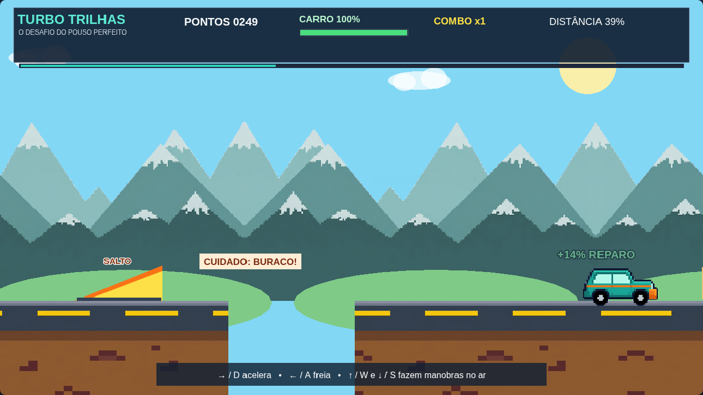

# 🏁 Turbo Trilhas — o desafio do pouso perfeito

> **Meu Terceiro Jogo (React + Phaser)** · **Nível:** básico+ · **Público:** 8–16 anos · **Tempo:** 8 aulas de 50–60 min  
> **Gênero:** corrida arcade lateral com rampas, acrobacias e pousos — sem armas.

Acelere por uma pista colorida, passe por obstáculos, faça manobras no ar e tente pousar sobre os dois pneus. A manobra só vale pontos quando o pouso é seguro. Se a carroceria bater primeiro ou o impacto for forte, o carro perde integridade. Chegue à bandeira e tente superar sua pontuação!



## 🎮 Jogue agora

### Jeito 1 — sem instalar nada

1. Abra a pasta `04-TerceiroJogo`.
2. Dê dois cliques em `index.html`.
3. O jogo abre no navegador; não precisa de internet.

O Phaser está em `lib/phaser.min.js`. O carro, as montanhas distantes e o piso usam PNGs em `assets/`; rampas, caixas, itens e outros detalhes continuam desenhados com `Graphics`. Para ver os sensores dos pneus, acrescente `?debug` ao endereço. Para exibir as caixas da física Arcade, use `?physics`.

### Jeito 2 — React + Vite

```bash
cd react
npm install
npm run dev
```

Abra o endereço que o Vite mostrar. O React monta a página; o Phaser desenha e atualiza o jogo dentro do componente `PhaserGame.jsx`.

> O mesmo jogo está nas duas versões. A versão sem instalação carrega o Phaser local; a versão React usa o pacote `phaser` 3.90.

## 🕹️ Controles

| Tecla | Ação |
|---|---|
| `→` ou `D` | Acelerar |
| `←` ou `A` | Frear |
| `↑` ou `W` | Inclinar o nariz para cima no ar |
| `↓` ou `S` | Inclinar o nariz para baixo no ar |
| `R` | Recomeçar depois da vitória ou fim de jogo |

Não existe botão de pulo: **as rampas lançam o carro**. Isso deixa espaço para aprender a controlar as manobras durante o voo. Se o teclado não responder, clique uma vez na área do jogo e tente de novo.

## 🎯 O que você aprende

- Mundo maior que a tela, câmera que acompanha e parallax;
- carregar um sprite PNG e tilesets próprios; desenhar rampas e objetos com `Graphics`;
- teclado, velocidade, aceleração, freio e gravidade;
- rampas, estado no ar e rotação do carro;
- sensores virtuais nos pneus e critérios de pouso;
- grupos, colisões, itens coletáveis, dano e reparo;
- pontuação, combo, HUD, efeitos, vitória e reinício.

### 🌄 Camadas de parallax

O céu fica parado; as nuvens usam `scrollFactor 0.08`, as montanhas do tileset `0.18` e as colinas desenhadas com código `0.42`. Como cada camada se move em uma velocidade diferente, o cenário parece ter profundidade. O piso repete o tileset horizontalmente, mas continua preso ao mundo da fase.

## 🛞 Como funciona o pouso

O jogo verifica os pontos virtuais dos pneus dianteiro e traseiro. Para um pouso seguro, os dois precisam estar junto à superfície, o carro deve ficar dentro do limite inicial de **25°** em relação ao nível e a velocidade vertical do impacto não pode passar do limite. Uma volta completa só conta depois de um pouso seguro.

**Detalhe importante do Phaser:** no Arcade Physics, a caixa retangular do corpo não gira automaticamente com o desenho. Por isso, `verificarRodas()` calcula a posição dos pneus a partir do centro do carro e do ângulo visual. O corpo Arcade continua cuidando da gravidade e das colisões com a pista; os sensores ajudam a decidir se o pouso foi bom.

> Quer enxergar os sensores? Abra `index.html?debug`. Os círculos verdes mostram os pontos dos dois pneus. `?physics` liga o modo de depuração do Arcade.

## 📚 Trilha de aulas

O mapa dos PNGs e do parallax está em [`assets/README.md`](assets/README.md). O plano completo está em [`ROTEIRO-DE-AULAS.md`](ROTEIRO-DE-AULAS.md), e as fichas de experimentação para estudantes estão em [`ATIVIDADES-DO-ALUNO.md`](ATIVIDADES-DO-ALUNO.md):

1. Mundo e câmera;
2. Carro, texturas e rodas;
3. Acelerar e frear;
4. Rampas e voo;
5. Manobras e combo;
6. Sensores e pouso;
7. Obstáculos, reparos e HUD;
8. Chegada e apresentação do jogo.

`src/scenes/Jogo.js` contém o jogo final e está dividido em comentários **ETAPA 0–8**. Em aula, a turma pode primeiro jogar o resultado, depois ler apenas a etapa do dia e mudar os desafios. O material para educadores está em [`MATERIAL-DO-PROFESSOR.md`](MATERIAL-DO-PROFESSOR.md), e os termos novos em [`GLOSSARIO.md`](GLOSSARIO.md).

## 🧱 Arquivos importantes

```text
04-TerceiroJogo/
├── README.md
├── ROTEIRO-DE-AULAS.md
├── ATIVIDADES-DO-ALUNO.md
├── MATERIAL-DO-PROFESSOR.md
├── GLOSSARIO.md
├── index.html                 # versão offline
├── index.css
├── lib/phaser.min.js          # Phaser local
├── assets/
│   ├── README.md
│   ├── sprites/carro-turbo.png
│   ├── parallax/montanhas-longe.png
│   └── tiles/pista-solo.png
├── src/main.js                # configura e liga o jogo
├── src/scenes/Jogo.js         # cena didática, com ETAPAs comentadas
└── react/                     # versão React + Vite
    ├── package.json
    └── src/
        ├── App.jsx
        ├── PhaserGame.jsx
        └── scenes/Jogo.js
```

## 🔧 Ajustes para brincar com o design

No começo de `src/scenes/Jogo.js`, experimente mudar as constantes `ACELERACAO`, `IMPULSO_MANOBRA`, `ANGULO_POUSO_SEGURO`, `VELOCIDADE_POUSO_SEGURA` e `DANO_POUSO_RUIM`. Mude **um valor por vez**, jogue e anote o que ficou mais fácil ou difícil. Isso também é game design!

## 🧩 Próximas ideias (opcionais)

- garagem para trocar a cor do carro;
- mais uma pista com rampas diferentes;
- botão de turbo e cronômetro;
- modo de treino com integridade infinita;
- controles na tela para celulares;
- melhorar a física usando um modelo mais avançado.

Os PNGs desta versão foram criados para o projeto e os demais elementos visuais são desenhados por código; não usamos imagens de jogos comerciais. Para compartilhar ou publicar no repositório, mantenha a licença geral e os créditos já adotados pelo projeto.
